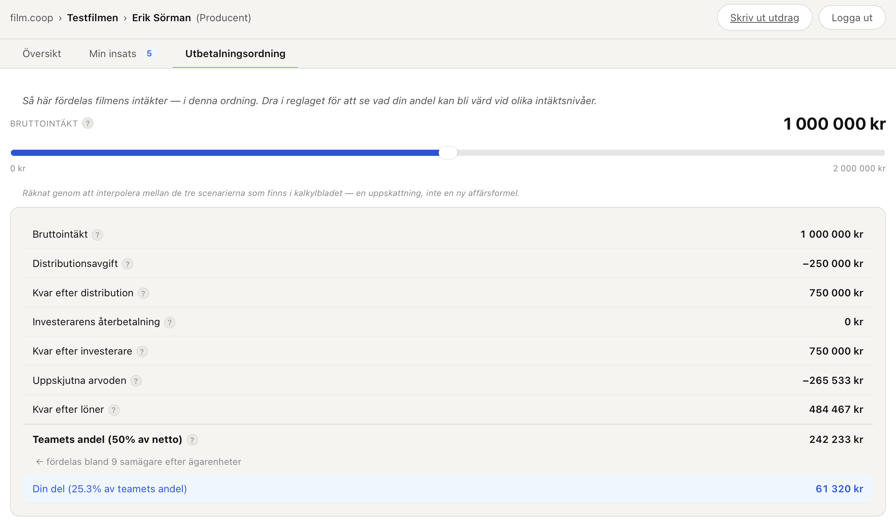
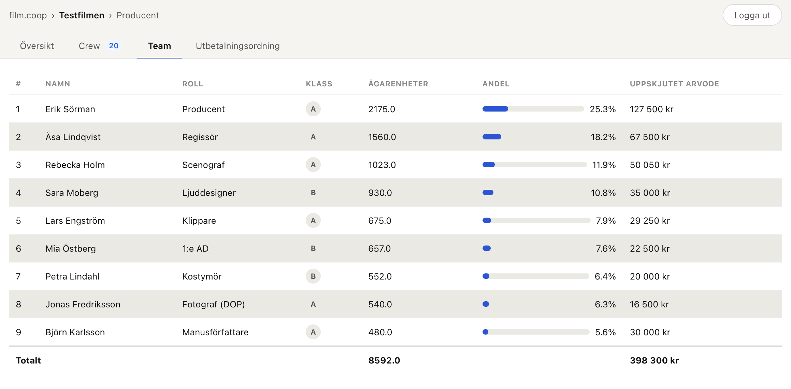
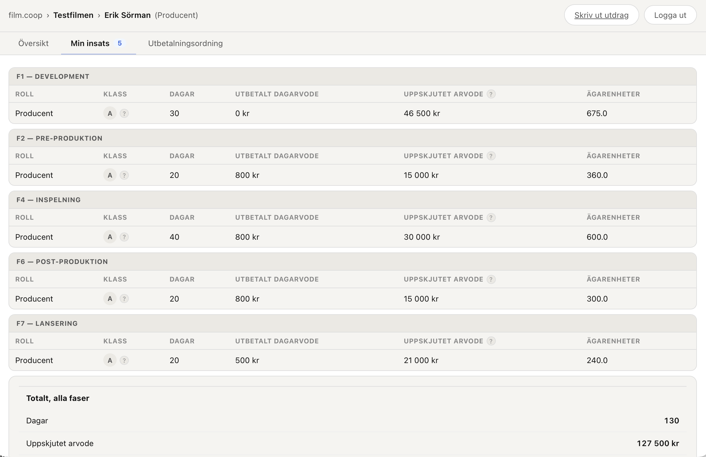
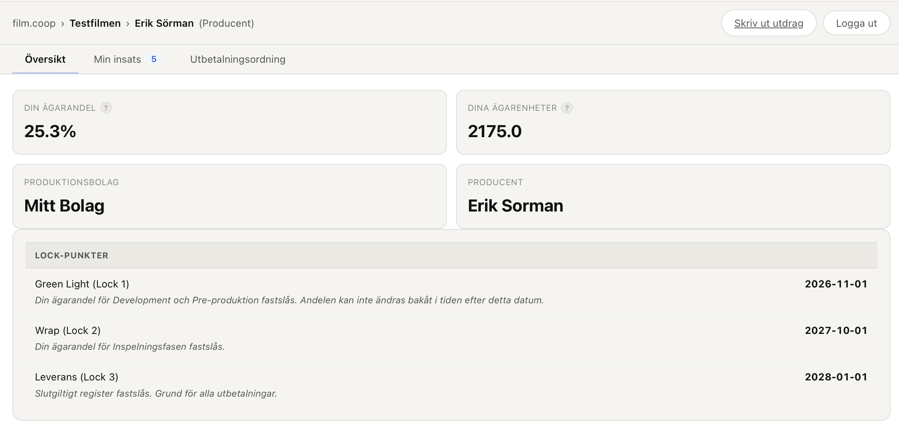

# film.coop

Öppen infrastruktur för kooperativ filmproduktion. En film ägs av de som gör
den.

film.coop ger filmteam ett system för att dela ägandeskap rättvist — baserat
på när i produktionen man går in, vilken funktion man har, och hur mycket man
faktiskt bidrar med. Uppskjutna arvoden konverteras till dokumenterade
ägarenheter som ger rätt till en andel av filmens intäkter.

→ [filmcoop.soxbox.uk](https://filmcoop.soxbox.uk) — läs mer och se hur det
fungerar

## Portalen i praktiken

| | |
|---|---|
|  |  |
| Dra i reglaget och se din andel räknas om live, för valfri intäktsnivå | Rankad lista efter ägarenheter, med totalsumma |
|  |  |
| Din egen insats, indelad per produktionsfas | Ägarandel, ägarenheter och lock-punkter på ett ställe |

## Tre delar

- **[Kalkylbladet](tools/filmcoop_v1.xlsx)** — Google Sheets baserat på SFI:s
  standardbudgetmall. Lägg till en e-postkolumn, fyll i dagar och
  arvodesnivåer — ägarandelarna räknas automatiskt. Fungerar för kortfilm,
  dokumentär och lång spelfilm.
- **[Portalen](app/)** — webbapp där teamet loggar in med Google och ser sin
  ägarandel, sina uppskjutna arvoden och vad andelen ger i olika
  försäljningsscenarier. Next.js, körs på egen server via Docker.
- **[Ramverket](docs/ramverk.md)** — fullständigt konceptdokument:
  poängsystem, fasindelning, lock-punkter, utbetalningsordning, koppling till
  SFI-budgeten.

## Kom igång

Se [docs/setup.md](docs/setup.md) för en komplett guide till kalkylbladet,
Google Cloud-uppsättningen och portalen.

```bash
git clone https://github.com/svenbox/filmcoop
cd filmcoop
cp .env.example .env   # fyll i värden, se docs/setup.md
docker compose up -d --build
```

## Crowdfunding

Vi bygger integration för att låta publiken äga en dokumenterad andel av
filmer de stödjer — inte merchandise, inte credits. Under utveckling, se
[docs/crowdfunding.md](docs/crowdfunding.md).

## Bidra

Se [CONTRIBUTING.md](CONTRIBUTING.md).

## Licens

MIT — se [LICENSE](LICENSE).
